### 作者QQ：1556708905(支持修改、 部署调试、 支持代做毕设)

#### 支持代做任何毕设论、接网站建设、小程序、H5、APP、各种系统等

**毕业设计所有选题地址 [https://github.com/zhengjianzhong0107/allProject](https://github.com/zhengjianzhong0107/allProject)**

**博客地址：
[https://blog.csdn.net/2303_76227485/article/details/131580873](https://blog.csdn.net/2303_76227485/article/details/131580873)**

**视频演示：
[https://www.bilibili.com/video/BV11u411L7oq/](https://www.bilibili.com/video/BV11u411L7oq/)**

 

## 基于springboot+vue的文物收藏系统(源代码+数据库+13000字论文)082

## 一、系统介绍

本项目前后端分离(本项目有ssm+vue版本)

本系统分为管理员、用户两种角色

用户角色包含以下功能：

- 登录、文物查看、文物资料下载、文物收藏管理、文物维护管理、文物封存管理、个人中心、密码修改

管理员角色包含以下功能：

- 登录、用户管理、文物展示管理、文物类型管理、公告栏管理、文物收藏管理、文物维护管理、文物封存管理
- 个人中心、密码修改、轮播图管理、菜单管理

## 二、所用技术

后端技术栈：

- springboot
- mybatisPlus
- mysql

前端技术栈：

- vue

## 三、环境介绍

基础环境 :IDEA/eclipse, JDK 1.8, Mysql5.7及以上,Node.js(14),Maven3.6

所有项目以及源代码本人均调试运行无问题 可支持远程调试运行

## 四、页面截图

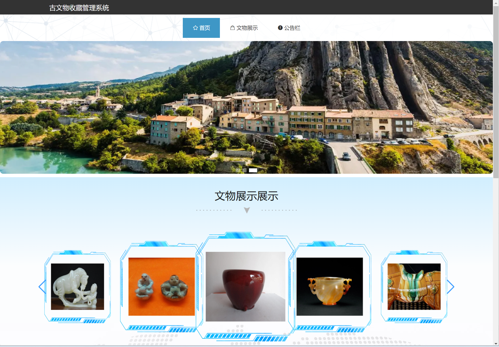
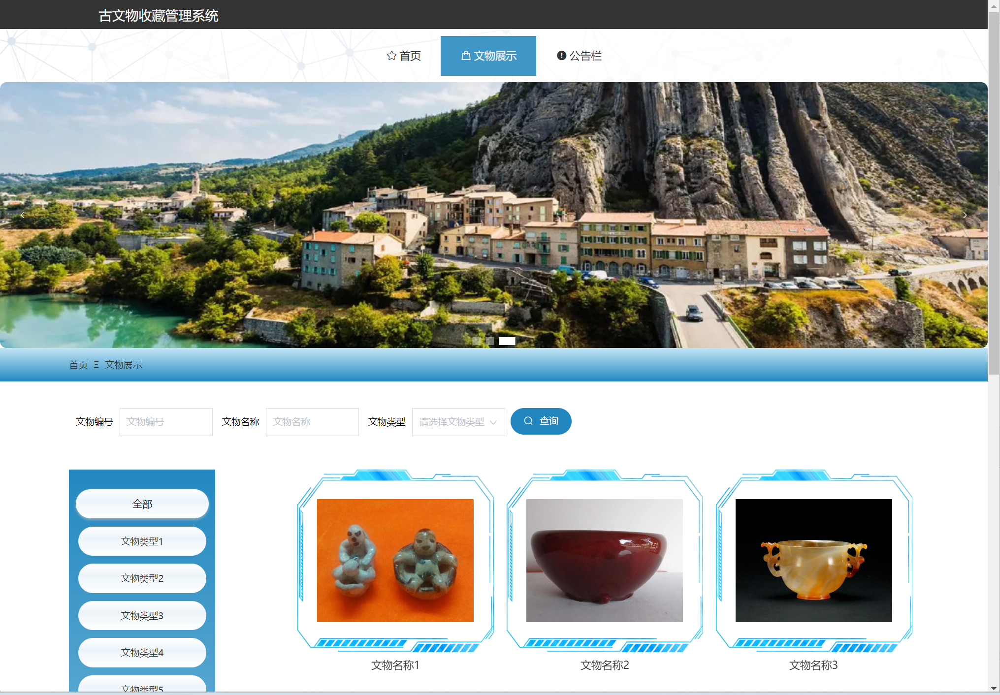
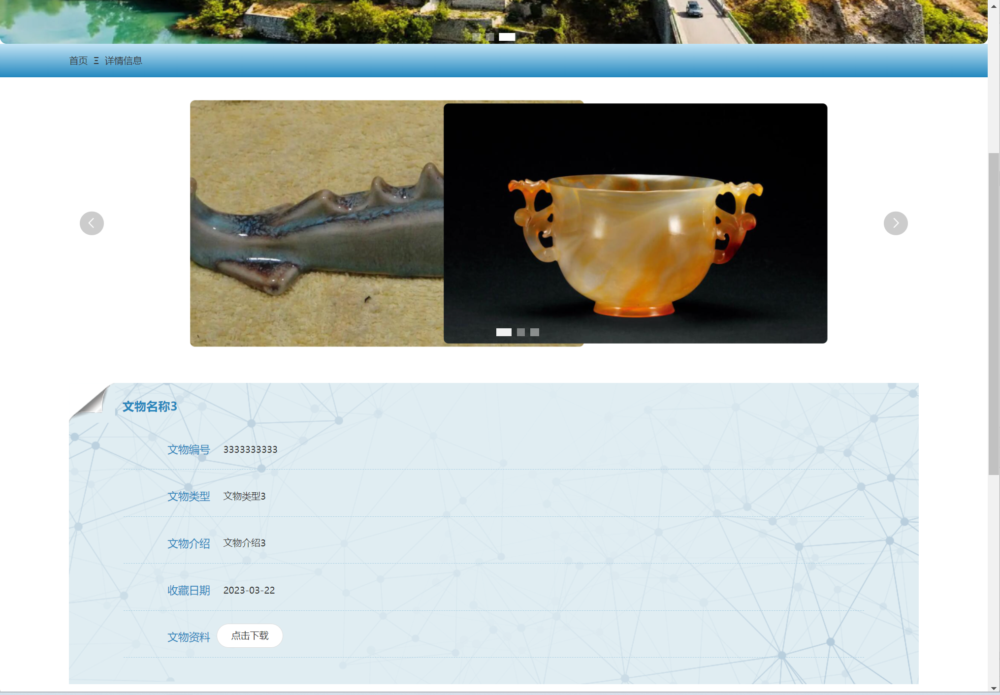

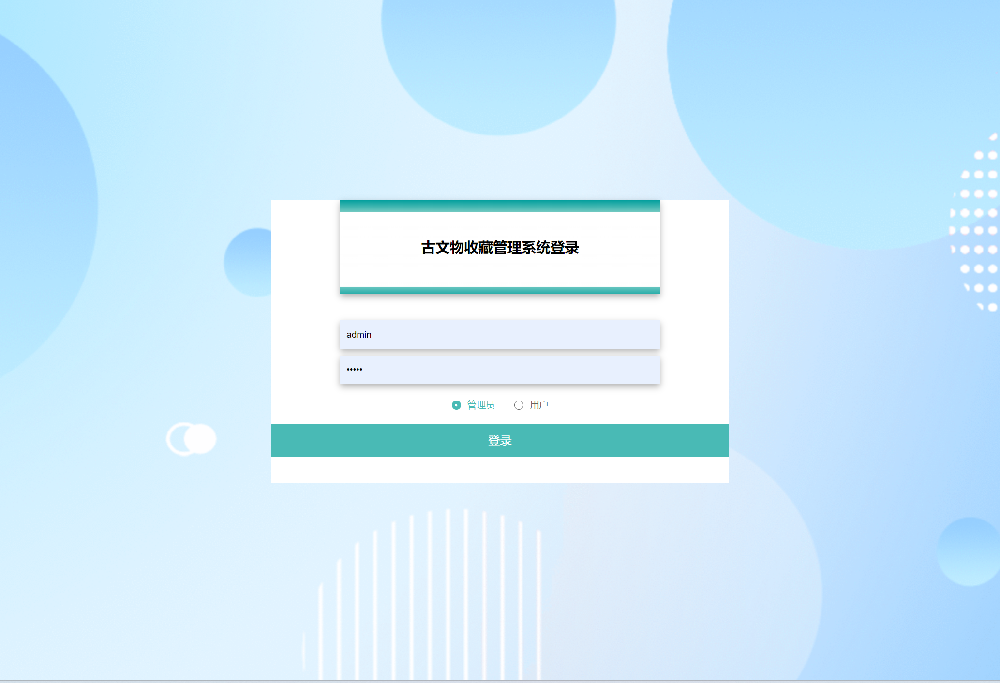

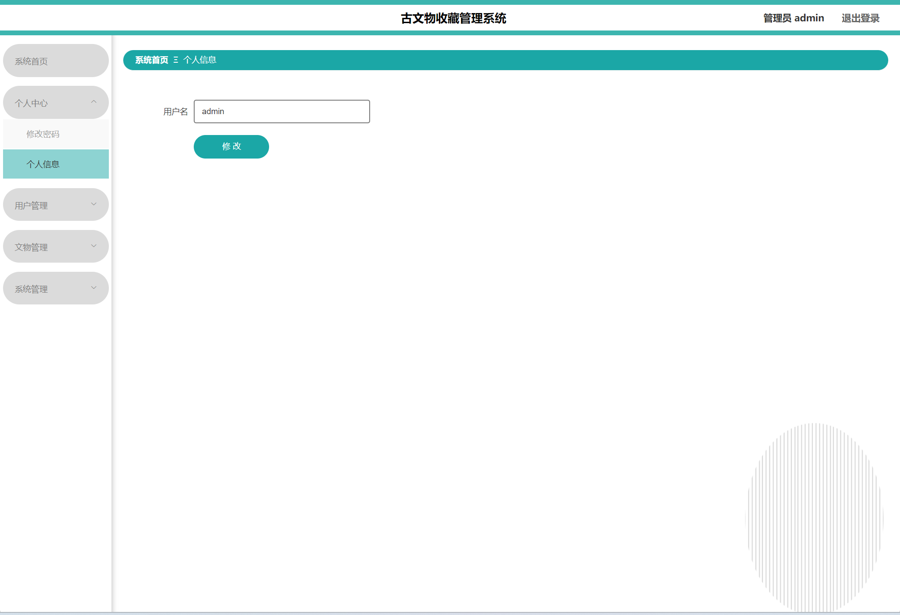
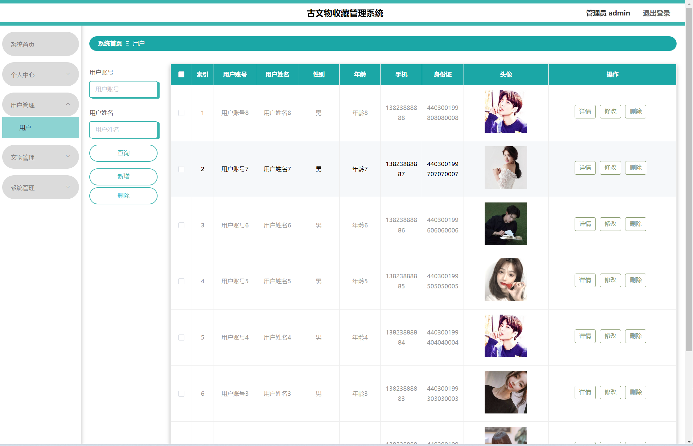

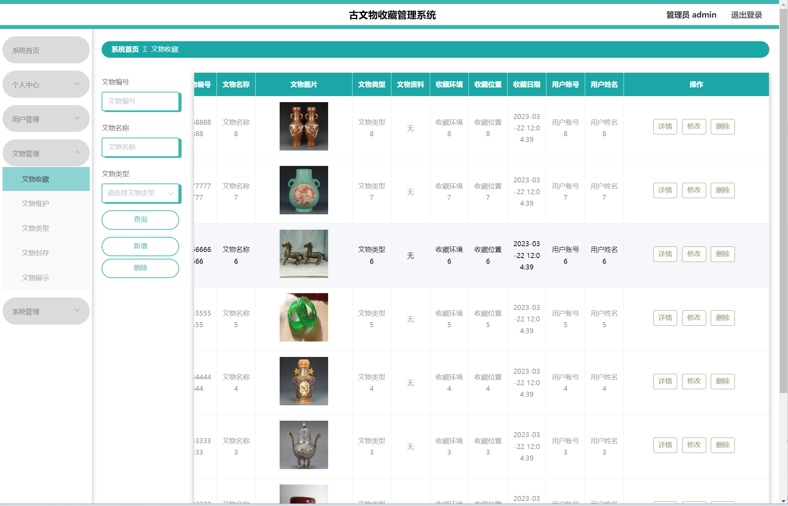
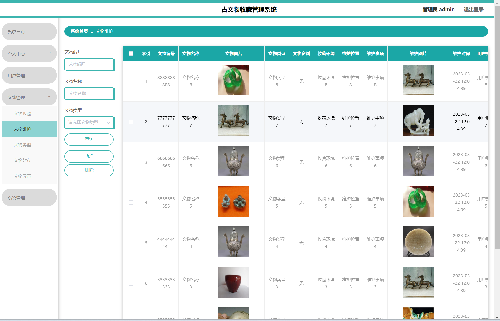
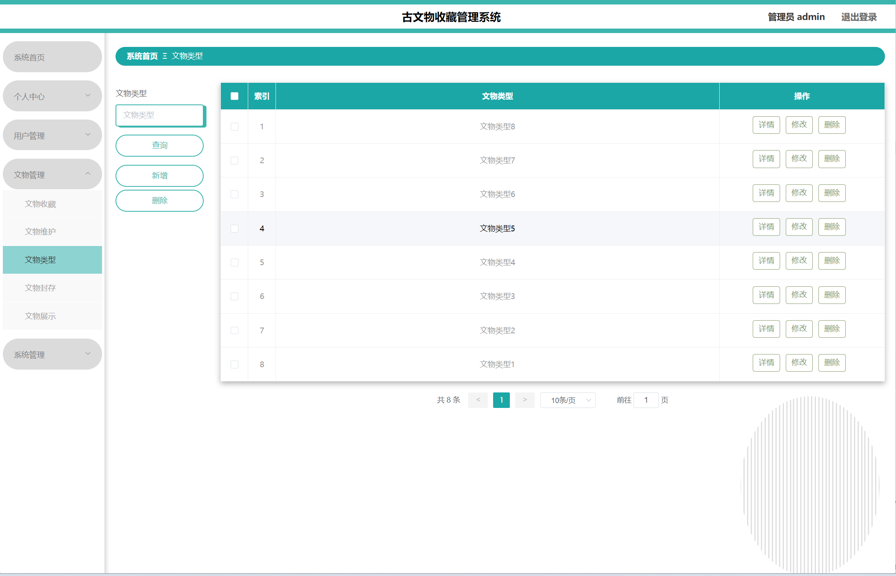
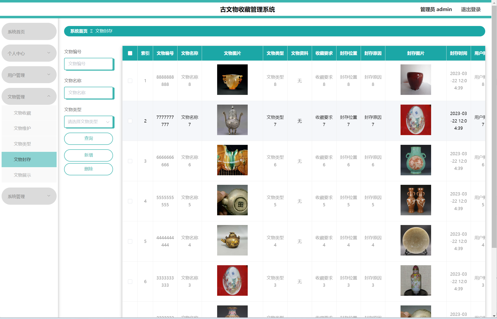

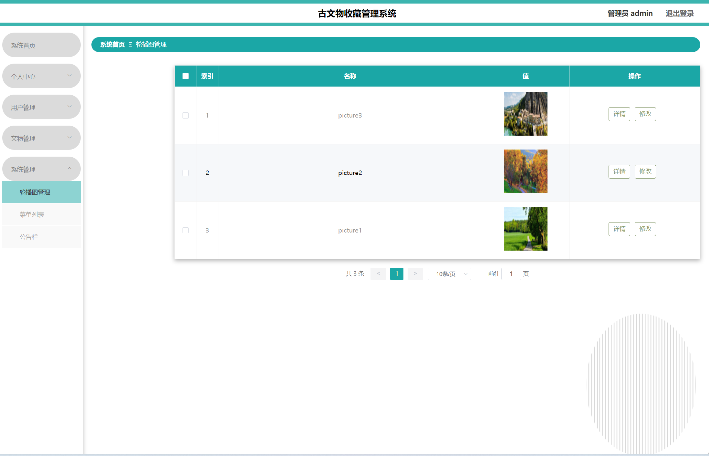
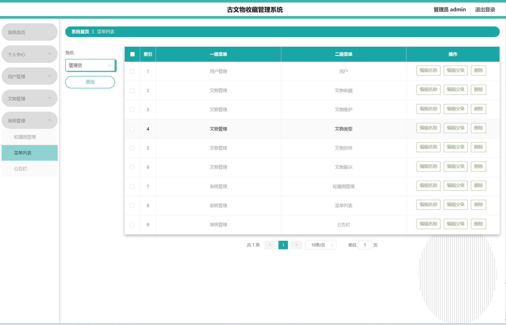
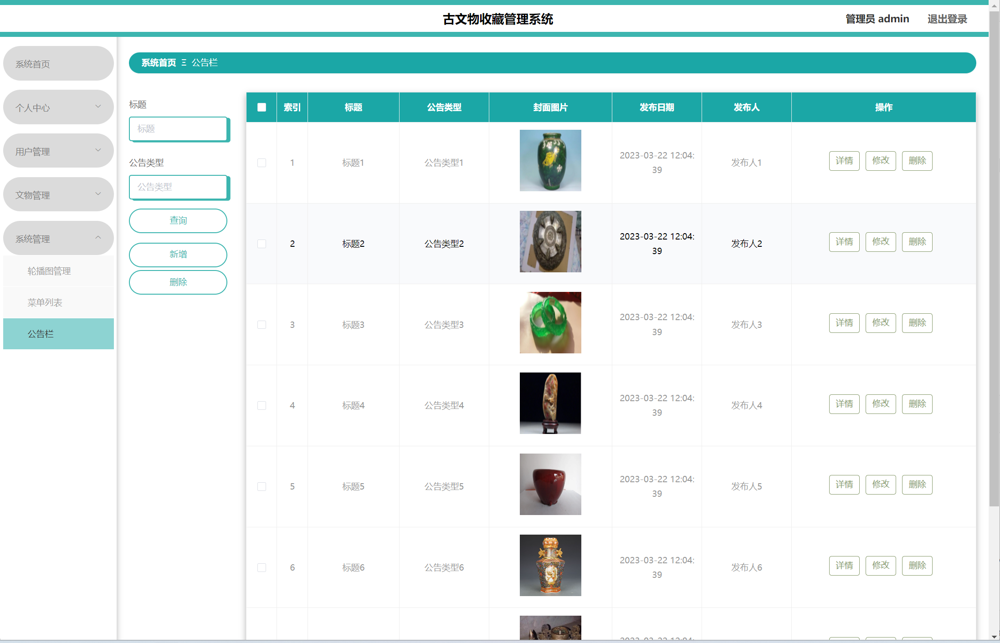
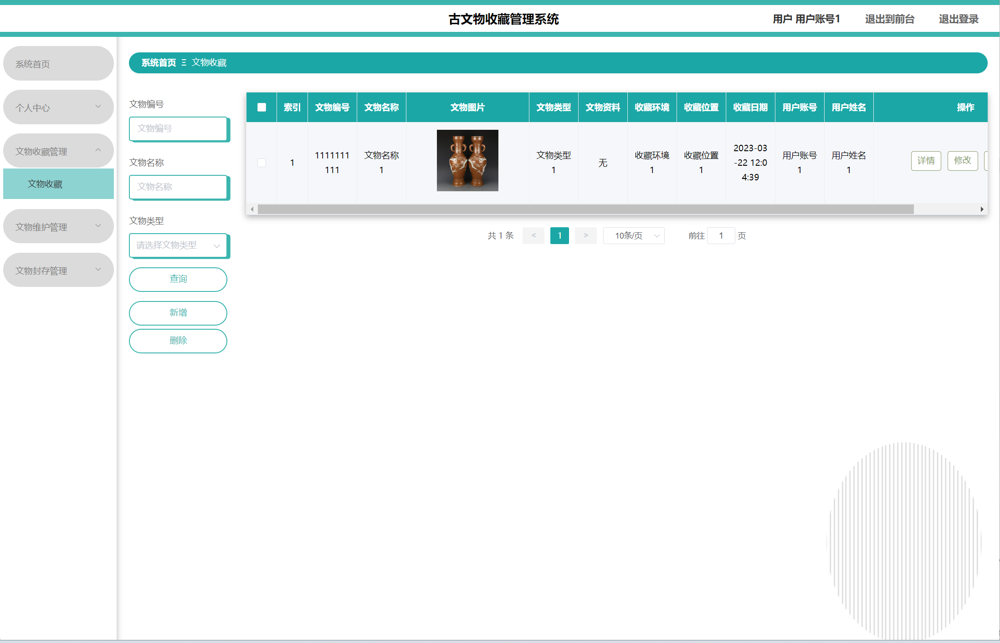

## 五、浏览地址

前台访问地址：http://localhost:8081

用户账号/密码：用户账号1/123456

后台访问地址：http://localhost:8082

管理员账号/密码：admin/admin

## 六、部署教程

1. 使用Navicat或者其它工具，在mysql中创建对应名称的数据库，并执行项目的sql文件；

2. 使用IDEA/Eclipse导入项目，若为maven项目请选择maven，等待依赖下载完成；

3. 进入src/main/resources修改application.yml 里面的数据库配置

4. src/main/java/com/SpringbootSchemaApplication.java里面启动项目

5. vscode或idea分别打开src/main/resources/admin和front项目，

6. 在编译器中打开terminal，执行npm install 依赖下载完成后执行 npm run serve,执行成功后会显示访问地址

 
